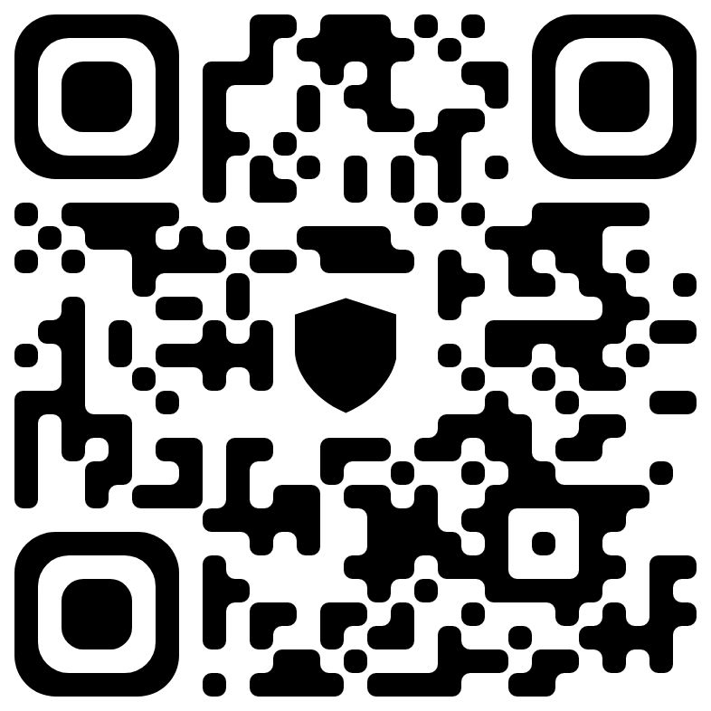

- [MY DONATE](DONATE.md)

# 💰 حمایت مالی (Donate)

اگر از پروژه من خوشتان آمده و مایل به حمایت مالی هستید، از شما سپاسگزارم. لطفاً قبل از ارسال، نکات زیر را به دقت مطالعه کنید.

---

## 🌐 اطلاعات کیف پول

**شبکه اتریوم (ERC20):**
`0x9cf5F23ddF4f4d6b410a65E7b08Ccec58a3cAf38`
0x9cf5F23ddF4f4d6b410a65E7b08Ccec58a3cAf38

**شبکه ترون (TRC20):**
`TF5kekGw26JhomRdZF585LiApT1Mb1xFN6`

---

## 📌 راهنمای ارسال

1.  **انتخاب شبکه صحیح**: حتماً ارز دیجیتال را روی شبکه‌ای که در کنار آدرس ذکر شده است، ارسال کنید. (ارسال از شبکه اشتباه باعث از دست رفتن دارایی می‌شود).
2.  **ارسال تتر (USDT)**: این آدرس‌ها برای دریافت `USDT` (تتر) و سایر ارزهای استاندارد آن شبکه طراحی شده‌اند.
3.  **دریافت کد هش (`TX Hash`)**: پس از انجام تراکنش، حتماً **کد هش تراکنش (TX Hash)** را برای من ارسال کنید تا بتوانم پرداخت شما را تأیید و پیگیری کنم. می‌توانید آن را از طریق [ایمیل/تلگرام/سایر] برای من بفرستید.

---

## ⚠️ نکات ایمنی و هشدارها

- **آدرس‌ها را دقیقاً بررسی کنید**: قبل از ارسال، از صحت آدرس کپی‌شده اطمینان حاصل کنید.
- **از شبکه درست استفاده کنید**: ارسال ارز به شبکه‌ی اشتباه، غیرقابل بازگشت است.
- **مبلغ را دقیق وارد کنید**: در صورت امکان، مبلغ را با دقت وارد کنید.
- **کارمزد تراکنش**: کارمزد شبکه به عهده فرستنده است.

---

## 🙏 سپاس‌گذاری

از حمایت شما بینهایت سپاسگزارم. این کمک‌ها به بهبود و توسعه پروژه کمک شایانی خواهد کرد.

تست نمایش فایل 

https://www.youtube.com/watch?v=ax2_5uwL6tg
 

برای تست تصویر 

https://github.com/Atashiran/HDMtest/blob/main/myQRTrustWall_USDT.jpg

 

